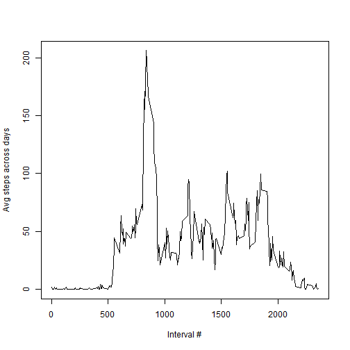
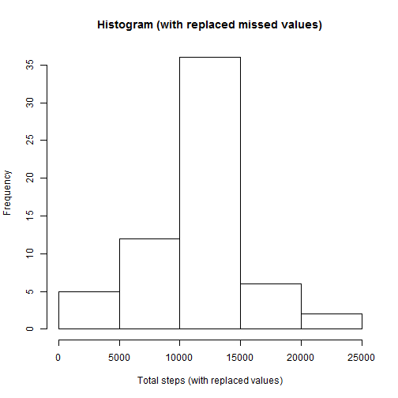
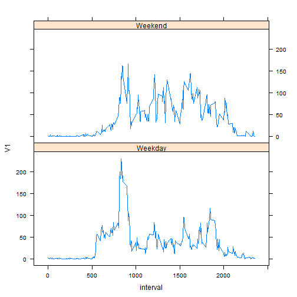

# Reproducible Research: Peer Assessment 1

## Loading and preprocessing the data
We assume that the data is in the same folder. 
We load data, and just convert columns to correct types


```r
file <- read.csv("activity.csv", stringsAsFactors = FALSE)
file$steps = as.numeric(file$steps)
file$date = as.Date(file$date)
file$interval = as.numeric(file$interval)
```


## What is mean total number of steps taken per day?
We group data by Date, and calculate Sum of steps over specific dates.


```r
stepsPerDay <- tapply(file$steps, file$date, sum)
summary(stepsPerDay)
```

```
##    Min. 1st Qu.  Median    Mean 3rd Qu.    Max.    NA's 
##      41    8840   10800   10800   13300   21200       8
```

Let's calculate mean and median over these steps

```r
meanStepsPerDay <- mean(na.omit(as.vector(stepsPerDay)))
medianStepsPerDay <- median(na.omit(as.vector(stepsPerDay)))
```

Mean steps per day: 1.0766 &times; 10<sup>4</sup>, median: 1.0765 &times; 10<sup>4</sup>.

## What is the average daily activity pattern?

Here is data for average daily activity pattern, as average steps by interval

```r
patternStepsPerInterval = tapply(file$steps, file$interval, mean, na.rm = TRUE)
summary(patternStepsPerInterval)
```

```
##    Min. 1st Qu.  Median    Mean 3rd Qu.    Max. 
##    0.00    2.49   34.10   37.40   52.80  206.00
```

```r
patternStepsNames <- rownames(patternStepsPerInterval)
plot(patternStepsNames, patternStepsPerInterval, type = "l", xlab = "Interval #", 
    ylab = "Avg steps across days")
```

 

Calculating maximum steps per day

```r
maxpatternStepsPerInterval = max(patternStepsPerInterval)
maxpatternStepsAtInterval = patternStepsNames[which.max(patternStepsPerInterval)]
```

Max pattern steps per day on average: 206.1698 occur at interval 835.
## Inputing missing values
Calculating missing values

```r
message(paste("This dataset has", nrow(file[is.na(file$steps), ]), "missing values"))
```

```
## This dataset has 2304 missing values
```

We fill missing values with mean for that 5-minute interval, calculated above


```r
fullData = data.frame(steps = file$steps, date = file$date, interval = file$interval)
fullData$steps <- with(fullData, ifelse(is.na(steps), patternStepsPerInterval[as.character(interval)], 
    steps))
```


Now, here's usage pattern for total steps per day, taking into account missing values

```r
fullStepsPerDay = tapply(fullData$steps, fullData$date, sum)
head(fullStepsPerDay)
```

```
## 2012-10-01 2012-10-02 2012-10-03 2012-10-04 2012-10-05 2012-10-06 
##      10766        126      11352      12116      13294      15420
```

```r
hist(fullStepsPerDay, xlab = "Total steps (with replaced values)", main = "Histogram (with replaced missed values)")
```

 


This method of filling missed values does not change mean of steps per day compared with original data. Median, however, will be changed

```r
fullmeanStepsPerDay = mean(fullStepsPerDay)
fullmedianStepsPerDay = median(fullStepsPerDay)
```

After filling data, mean is different from original dataset by 0, median is different by 1.1887.


## Are there differences in activity patterns between weekdays and weekends?
We fill dataset with information on weekdays, and aggregate it over interval # and (isWeekend) function

```r
isWeekend <- function(d) {
    val <- weekdays(as.Date(d), abbreviate = TRUE)
    if (val == "Sun" || val == "Sat") {
        return("Weekend")
    }
    return("Weekday")
}
fullData$weekday = as.factor(sapply(fullData$date, isWeekend))

aggData <- aggregate(as.matrix(fullData[, "steps"]), as.list(fullData[, c("weekday", 
    "interval")]), FUN = mean)
```


Now we aggregated data over interval and weekday

Visualizing differences in patterns between weekdays and weekends

```r
library("lattice")
xyplot(V1 ~ interval | weekday, data = aggData, type = "l", layout = c(1, 2))
```

 

We can see that peak usage happens at roughly the same time, though activity after peak usage time is different.

